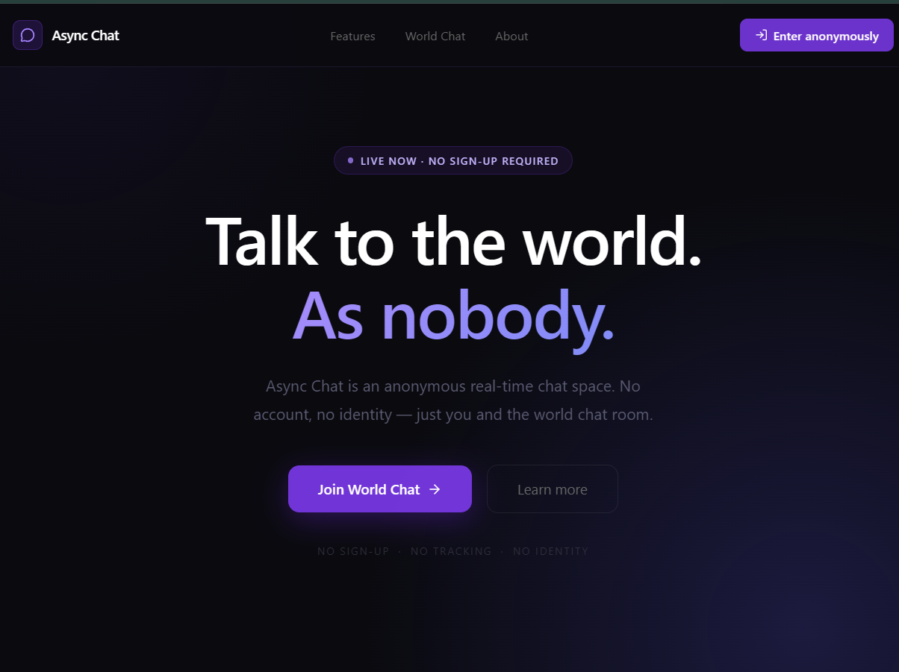
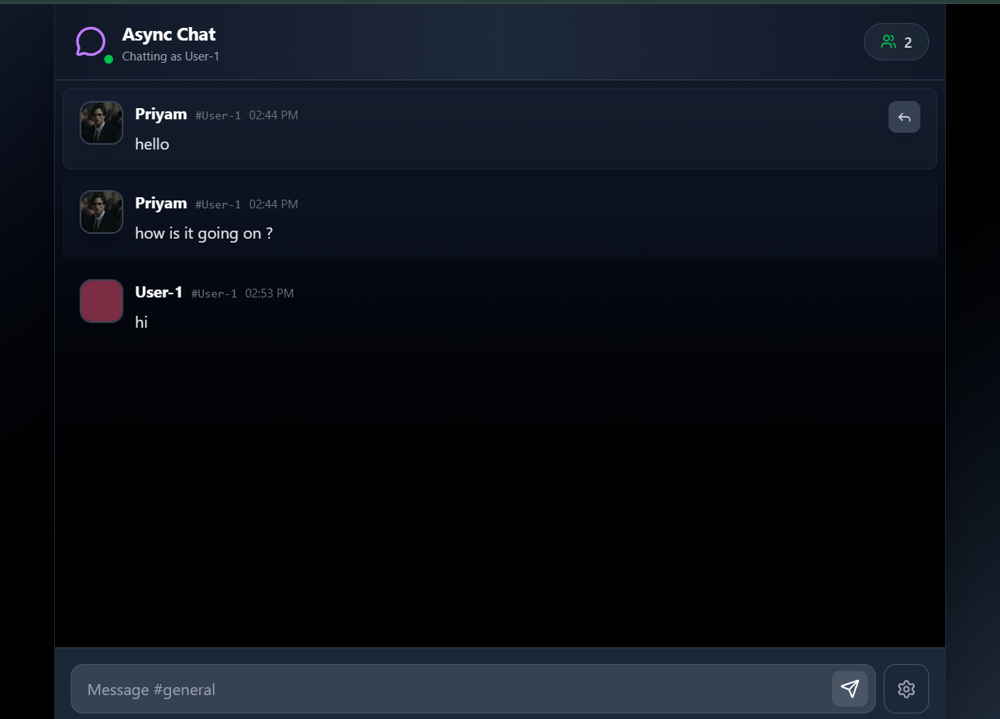

# Async Chat 💬

**Talk to the world. As nobody.**

Async Chat is a lightweight, anonymous real-time chat web app that lets users connect instantly without sign-ups or identity requirements. It focuses on simplicity, privacy, and fast conversations.

---

## 🚀 Features

- 🕶️ **Anonymous Chat**
  - No sign-up required
  - No personal data or identity tracking

- 👤 **Custom Profiles**
  - Set your display name
  - Upload or choose a profile photo

- 🌐 **Real-Time Communication**
  - Instantly connect with others online
  - Live message updates without refresh

- 💬 **Threaded Replies**
  - Reply to specific messages
  - Keep conversations organized and contextual

- 🧹 **Ephemeral Message Storage**
  - Only the **last 50 messages** are retained
  - Older messages are automatically removed

- ⚡ **Lightweight & Fast**
  - Minimal UI for distraction-free chatting
  - Optimized for quick interactions

---

## 🖼️ Screenshots

### 🏠 Main Page



> Landing page with anonymous entry and call-to-action to join the world chat.

---

### 💬 Chat Interface



> Real-time global chat with threaded replies and user presence.

---

## 🛠️ Tech Stack (Example)

> _(Customize this section based on your actual stack)_

- **Frontend:** React / Next.js / Vue
- **Backend:** Node.js / Express / WebSockets
- **Real-time:** Socket.IO / WebRTC / Firebase
- **Storage:** In-memory / Redis (for last 50 messages)

---

## 📦 Installation

```bash
# Clone the repository
git clone https://github.com/your-username/async-chat.git

# Navigate into the project
cd async-chat

# Install dependencies
npm install

# Start development server
npm run dev
